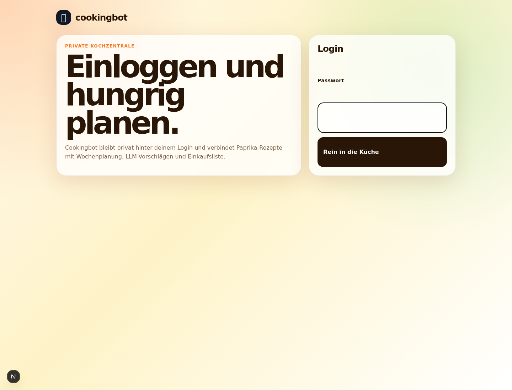
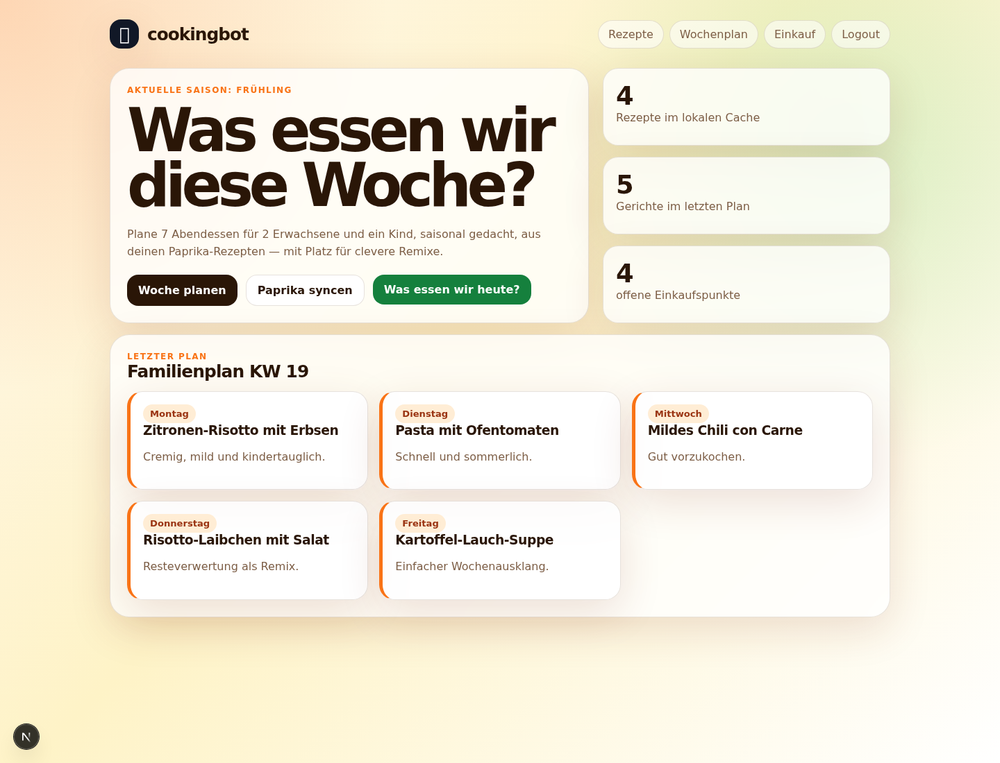
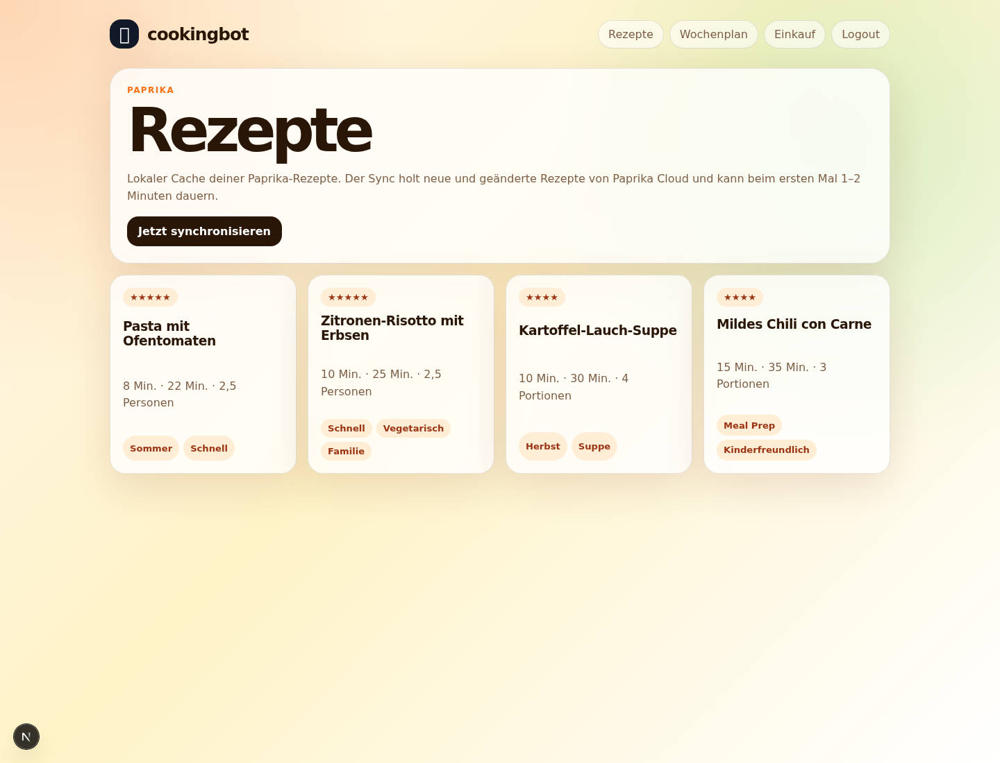
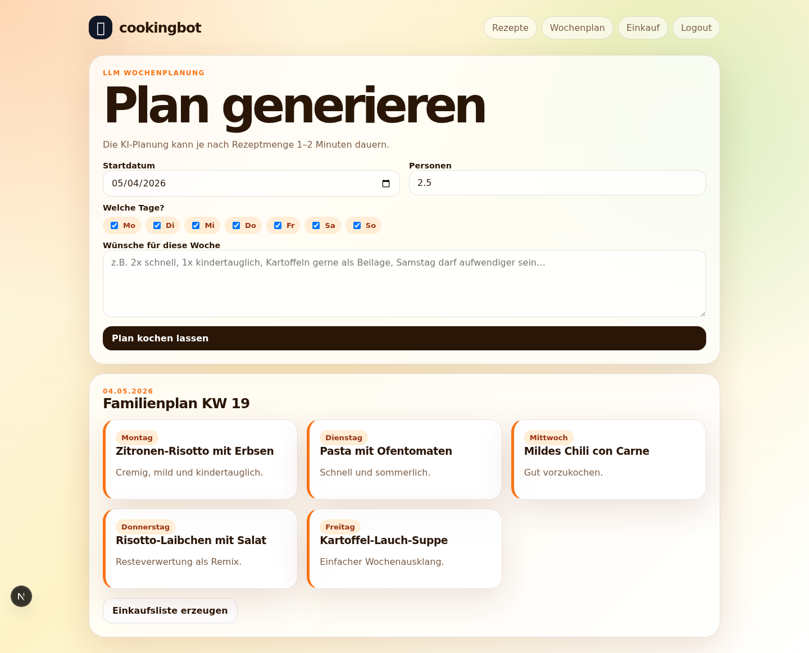
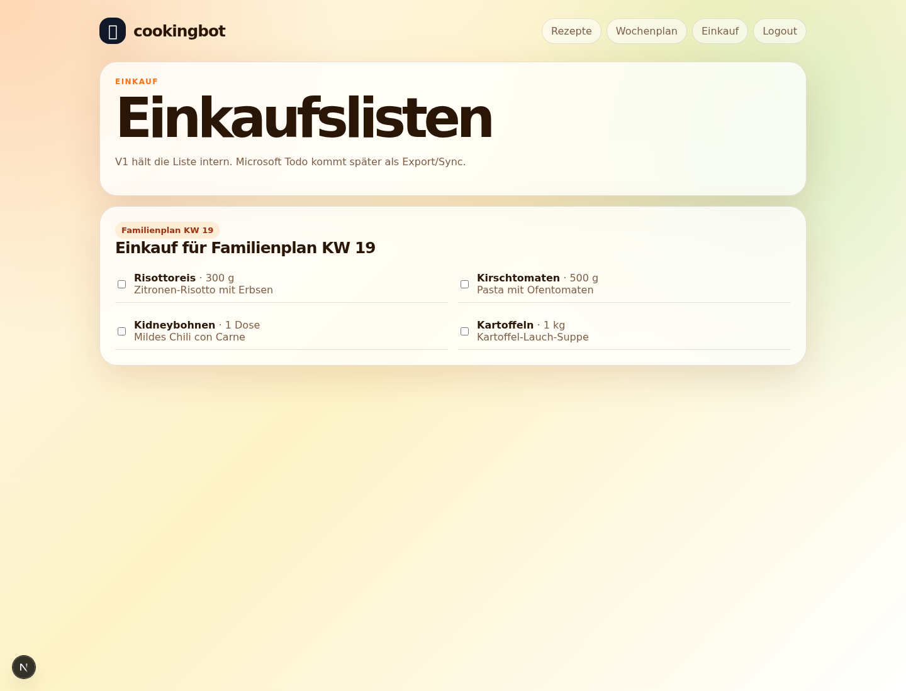

# cookingbot

Private Kochhilfe für Wochenplanung mit Paprika-3-Rezepten, LLM-Vorschlägen, Remix-Ideen und Einkaufsliste.

cookingbot ist als private NAS-/Portainer-App gedacht: Paprika-Rezepte lokal synchronisieren, daraus Wochenpläne bauen lassen, Gerichte tauschen oder remixen und am Ende eine Einkaufsliste erzeugen bzw. nach Microsoft To Do exportieren.

## Inhaltsverzeichnis

- [Funktionsumfang](#funktionsumfang)
- [Screenshots / UI-Bereiche](#screenshots--ui-bereiche)
- [Voraussetzungen](#voraussetzungen)
- [Alle ENV-Variablen](#alle-env-variablen)
- [Setup lokal](#setup-lokal)
- [Docker Compose](#docker-compose)
- [Portainer / NAS](#portainer--nas)
- [Microsoft To Do einrichten](#microsoft-to-do-einrichten)
- [MCP-Server für Claude](#mcp-server-für-claude)
- [Typischer Workflow](#typischer-workflow)
- [Daten, Backup und Updates](#daten-backup-und-updates)
- [Entwicklung](#entwicklung)
- [Troubleshooting](#troubleshooting)

## Funktionsumfang

### App & UI

- Login-geschützte private Website mit Session-Cookies
- Show/Hide-Passwort im Login
- Warmer „Paprika-Cache“-Look mit Papierfarben, Serif-Headlines und dunklen Akzenten
- Desktop-Sidebar und mobile Tabbar
- Dark-Mode-Unterstützung über `prefers-color-scheme`
- Respektiert `prefers-reduced-motion`
- Settings-Seite mit Deployment-, Integrations-, Daten- und LLM-Status
- Healthcheck-Endpoint für Docker: `/api/health`

### Dashboard

- Saison-Hinweis
- „Heute Abend“-Hero aus dem aktuellen Plan oder Empty-State
- Statistik-Kacheln
- 7-Tage-Wochengrid mit Heute-Markierung und Klick-Slots
- Schnelle Einstiege zu Rezepten, Planung und Einkauf

### Rezepte

- Paprika Cloud Sync in lokalen SQLite-Cache
- Speicherung wichtiger Paprika-Felder inklusive Bild-URLs/Foto-Feldern
- Rezeptbilder über serverseitigen Image-Proxy: `/api/recipe-image/[recipeId]`
- Fallback auf deterministische Farbkacheln/Glyphs, wenn kein Bild vorhanden ist
- Suche
- Filter-Pills:
  - Schnell
  - Vegetarisch
  - Kindertauglich
  - Saisonal
  - Meal Prep
  - Suppe
- Sortierung nach Bewertung, Name und Sync-Datum
- Rezeptkarten mit Bewertung, Zeit/Portionen und Top-Chips wie „Lieblingsrezept“ oder „Nicht für Plan“
- Top-Chips sind auch bei vorhandenen Rezeptbildern oben links fixiert
- Rezept-Modal mit Zutaten, Zubereitung, Notizen und Quell-Link
- Focus-Trap und ESC-Schließen im Modal
- Manuelles Ausschließen einzelner Rezepte von der Abendplanung

### Wochenplanung

- LLM-basierte Wochenplanung aus lokalem Paprika-Cache
- Harte Filter gegen ungeeignete Abendessen, z. B. Cocktails/alkoholische Getränke
- Tag-Toggles mit Tastatur-Navigation
- Personenstepper von 1,0 bis 6,0 in 0,5er-Schritten
- Startdatum mit:
  - Desktop: eigener optisch angepasster Kalender-Popup
  - Mobile: nativer Mobile-Datepicker
  - manueller Eingabe im Format `TT.MM.JJJJ`
  - `−7` / `+7` Buttons für exakte Wochen-Sprünge ohne UTC-Datumsversatz
- Plan-Tabs für mehrere KW-Versionen
- Pro Gericht:
  - Öffnen
  - Tausch / neu planen
  - Remix
  - optional Remix nach Paprika exportieren
- Plan-Footer zum Erzeugen der Einkaufsliste

### LLM / KI

- OpenAI-kompatible API
- Getrennte Modelle für:
  - Wochenplanung (`OPENAI_PLANNER_MODEL`)
  - kreative Remixe (`OPENAI_REMIX_MODEL`)
- `OPENAI_MODEL` als optionaler Fallback
- `OPENAI_BASE_URL` für kompatible Provider oder Proxies

### Einkaufsliste

- Einkaufsliste aus Wochenplan generieren
- Gruppierung nach Abteilungen/Kategorien mit Fallback-Kategorisierung in `src/lib/shopping-categories.ts`
- Fortschritts-Ring
- Optimistic Toggle für einzelne Items
- Bulk-Aktionen über `/api/shopping/bulk`
- Erledigte ausblenden
- Druckansicht
- Optionaler Export einzelner Einkaufspunkte nach Microsoft To Do
- Bereits exportierte Punkte werden nicht erneut exportiert

### Paprika Export

- Geremixte Gerichte können als neue Rezepte nach Paprika exportiert werden
- Export speichert das neue Rezept auch lokal im cookingbot-Cache
- Wochenplan-Gericht wird danach mit dem neu erzeugten Rezept verknüpft
- Nutzt inoffizielle Paprika-Schreibendpunkte; kann bei Paprika-API-Änderungen Anpassung brauchen

## Screenshots / UI-Bereiche

Die Screenshots in `docs/screenshots/` zeigen Demo-Daten im aktuellen UI-Stil.

### Login

Privater Zugang mit eigenem Passwort und Show/Hide-Toggle.



### Dashboard

Saison-Hinweis, „Heute Abend“-Hero, Statistiken und 7-Tage-Grid.



### Rezepte

Paprika-Cache mit Suche, Filtern, Sortierung, Rezeptkarten, Bildern/Farbkacheln und Modal.



### Wochenplan

Planformular mit Datum, Personen, Tagen und rechts Plan-Versionen mit Aktionen.



### Einkaufsliste

Gruppierte Einkaufsliste mit Fortschritt, Bulk-Aktionen und Microsoft-To-Do-Export.



## Voraussetzungen

Für Betrieb:

- Docker + Docker Compose oder Portainer
- Paprika-Cloud-Zugangsdaten
- OpenAI-kompatibler API-Key
- starkes Admin-Passwort für cookingbot
- langes Session-Secret, z. B.:

```bash
openssl rand -base64 32
```

Optional:

- Microsoft-Entra-App für Microsoft-To-Do-Export
- Reverse Proxy mit HTTPS, wenn die App außerhalb des Heimnetzes erreichbar ist

> Wichtig: Paprika bietet keine offiziell stabile Public API. cookingbot nutzt inoffizielle/experimentelle Sync- und Export-Endpunkte. Lesen funktioniert aktuell, Schreiben/Export kann bei API-Änderungen brechen.

## Alle ENV-Variablen

Die Vorlage liegt in `.env.example`.

### Komplettes Beispiel

```env
# App
APP_BASE_URL=http://localhost:3000
APP_SESSION_SECRET=change-me-to-a-long-random-string
APP_ADMIN_PASSWORD=change-me

# Local development: file:./dev.db
# Docker/Portainer: file:/data/cookingbot.db
DATABASE_URL=file:/data/cookingbot.db

# OpenAI-compatible LLM
OPENAI_API_KEY=
OPENAI_MODEL=
OPENAI_PLANNER_MODEL=gpt-5.4-mini
OPENAI_REMIX_MODEL=gpt-5.5
OPENAI_BASE_URL=

# Paprika Cloud Sync
PAPRIKA_EMAIL=
PAPRIKA_PASSWORD=
PAPRIKA_API_BASE=https://www.paprikaapp.com/api

# Microsoft To Do export
MICROSOFT_CLIENT_ID=
MICROSOFT_CLIENT_SECRET=
MICROSOFT_TENANT_ID=consumers

# Reverse proxy / security
TRUST_PROXY=

# Docker startup
PRISMA_DB_PUSH_ON_START=true
```

### App / Security

| Variable | Pflicht | Beispiel | Beschreibung |
|---|---:|---|---|
| `APP_BASE_URL` | empfohlen / für Microsoft Pflicht | `https://cookingbot.example.com` | Öffentliche oder lokale Basis-URL der App. Wird für absolute Redirects und Microsoft OAuth genutzt. Muss exakt zur verwendeten URL passen. |
| `APP_SESSION_SECRET` | Production: ja | zufälliger 32+ Zeichen Wert | Signiert Session-Cookies. In Production darf kein Default/kurzer Wert verwendet werden. |
| `APP_ADMIN_PASSWORD` | Production: ja | langes Passwort | Login-Passwort. In Production mindestens 12 Zeichen und nicht `change-me`. |
| `TRUST_PROXY` | nein | `true` | Nur setzen, wenn cookingbot hinter einem vertrauenswürdigen Reverse Proxy läuft, der `X-Forwarded-For` korrekt setzt. Sonst leer lassen, damit Rate-Limiting nicht spoofbar wird. |

### Datenbank

| Variable | Pflicht | Beispiel | Beschreibung |
|---|---:|---|---|
| `DATABASE_URL` | ja | `file:/data/cookingbot.db` | Prisma/SQLite Datenbank-URL. Lokal meist `file:./dev.db`, Docker/Portainer `file:/data/cookingbot.db`. |
| `PRISMA_DB_PUSH_ON_START` | nein | `true` | Docker-Start führt standardmäßig `prisma db push --skip-generate` aus. Für private NAS-Nutzung bequem. Auf `false` setzen, wenn Schema-Updates manuell laufen sollen. |

### LLM / OpenAI-kompatible API

| Variable | Pflicht | Beispiel | Beschreibung |
|---|---:|---|---|
| `OPENAI_API_KEY` | für Planung/Remix ja | `sk-...` | API-Key für OpenAI oder kompatiblen Provider. |
| `OPENAI_PLANNER_MODEL` | nein | `gpt-5.4-mini` | Modell für Wochenplanung. Fällt auf `OPENAI_MODEL` und dann Default zurück. |
| `OPENAI_REMIX_MODEL` | nein | `gpt-5.5` | Modell für kreative Remixe. Fällt auf `OPENAI_MODEL` und dann Default zurück. |
| `OPENAI_MODEL` | nein | `gpt-5.4-mini` | Optionaler gemeinsamer Fallback, falls Planner/Remix nicht gesetzt sind. |
| `OPENAI_BASE_URL` | nein | `https://api.openai.com/v1` | Für OpenAI leer lassen. Für kompatible Provider/Proxies setzen. |

Empfohlene Modelltrennung:

```env
OPENAI_PLANNER_MODEL=gpt-5.4-mini
OPENAI_REMIX_MODEL=gpt-5.5
```

So bleibt Planung günstiger/schneller, während Remixe mit einem stärkeren Modell laufen.

### Paprika

| Variable | Pflicht | Beispiel | Beschreibung |
|---|---:|---|---|
| `PAPRIKA_EMAIL` | für Sync ja | `name@example.com` | Paprika-Cloud-Mailadresse. Server-side only. |
| `PAPRIKA_PASSWORD` | für Sync ja | `...` | Paprika-Cloud-Passwort. Server-side only. |
| `PAPRIKA_API_BASE` | nein | `https://www.paprikaapp.com/api` | Basis-URL der inoffiziellen Paprika API. Normalerweise Default lassen. |

### Microsoft To Do

| Variable | Pflicht | Beispiel | Beschreibung |
|---|---:|---|---|
| `MICROSOFT_CLIENT_ID` | nur für To Do | `...` | Client ID der Microsoft-Entra-App. |
| `MICROSOFT_CLIENT_SECRET` | nur für To Do | `...` | Client Secret der Microsoft-Entra-App. |
| `MICROSOFT_TENANT_ID` | nein | `consumers` | Tenant für OAuth. Für private Microsoft-Konten meist `consumers`. |

Redirect URI in Microsoft muss exakt sein:

```text
${APP_BASE_URL}/api/microsoft/callback
```

### Runtime / Docker

| Variable | Pflicht | Beispiel | Beschreibung |
|---|---:|---|---|
| `PORT` | nein | `3000` | Wird von `npm start` genutzt. Im Docker-Image ist intern Port `3000` vorgesehen. |
| `NODE_ENV` | nein | `production` | Wird im Dockerfile automatisch gesetzt. Normalerweise nicht manuell ändern. |
| `NEXT_TELEMETRY_DISABLED` | nein | `1` | Im Dockerfile automatisch gesetzt. |
| `MCP_BEARER_TOKEN` | nein | `lange-Zufallszeichenkette` | Aktiviert den `/mcp`-Endpoint für externe LLM-Clients. Ohne Wert antwortet `/mcp` mit HTTP 503. Siehe [MCP-Server für Claude](#mcp-server-für-claude). |

## Setup lokal

```bash
cp .env.example .env
# .env ausfüllen
# lokal DATABASE_URL=file:./dev.db setzen
npm install
npm run db:push
npm run dev
```

Dann öffnen:

```text
http://localhost:3000
```

Nützliche lokale Checks:

```bash
npm run lint
npm run typecheck
npm run test
npm run build
```

## Docker Compose

```bash
cp .env.example .env
# .env ausfüllen, DATABASE_URL=file:/data/cookingbot.db lassen
docker compose up -d --build
```

Die SQLite-Datenbank liegt im Docker-Volume `cookingbot-data` unter:

```text
/data/cookingbot.db
```

Healthcheck:

```text
http://localhost:3000/api/health
```

## Portainer / NAS

### Variante A: Stack aus GitHub

1. Portainer öffnen.
2. **Stacks → Add stack**.
3. Name: `cookingbot`.
4. **Repository** wählen.
5. Repository URL setzen, z. B.:

```text
https://github.com/synobazz/cookingbot.git
```

6. Compose path:

```text
docker-compose.yml
```

7. Environment Variables setzen:

```env
APP_BASE_URL=http://NAS-IP:3000
APP_SESSION_SECRET=<openssl-rand-base64-32>
APP_ADMIN_PASSWORD=<langes-login-passwort>
DATABASE_URL=file:/data/cookingbot.db

OPENAI_API_KEY=<api-key>
OPENAI_MODEL=
OPENAI_PLANNER_MODEL=gpt-5.4-mini
OPENAI_REMIX_MODEL=gpt-5.5
OPENAI_BASE_URL=

PAPRIKA_EMAIL=<paprika-email>
PAPRIKA_PASSWORD=<paprika-passwort>
PAPRIKA_API_BASE=https://www.paprikaapp.com/api

MICROSOFT_CLIENT_ID=<client-id>
MICROSOFT_CLIENT_SECRET=<client-secret>
MICROSOFT_TENANT_ID=consumers

TRUST_PROXY=
PRISMA_DB_PUSH_ON_START=true
```

8. Stack deployen.
9. App öffnen: `http://NAS-IP:3000` oder über Reverse Proxy.

### Variante B: Web editor

Der reine Portainer-Web-Editor braucht ein bereits veröffentlichtes Container-Image. Wenn kein Image auf GHCR/Docker Hub existiert, Variante A nutzen, damit Portainer direkt aus dem Repository baut.

### Reverse Proxy / HTTPS

Wenn cookingbot außerhalb des Heimnetzes erreichbar ist, nur über HTTPS veröffentlichen, z. B. via Synology Reverse Proxy, Nginx Proxy Manager, Traefik oder Cloudflare Tunnel.

Empfehlung:

```text
extern: https://cookingbot.example.com
intern: http://cookingbot:3000 oder http://NAS-IP:3000
APP_BASE_URL=https://cookingbot.example.com
```

Wenn du nur intern testest:

```env
APP_BASE_URL=http://NAS-IP:3000
```

Bei HTTPS setzt cookingbot Secure-Cookies.

`TRUST_PROXY=true` nur setzen, wenn der Proxy vertrauenswürdig ist und `X-Forwarded-For` korrekt setzt.

## Microsoft To Do einrichten

cookingbot exportiert Einkaufspunkte über Microsoft Graph als Aufgaben.

1. Microsoft Entra Admin Center / Azure Portal öffnen.
2. Neue App Registration erstellen.
3. Supported account types:
   - für private Konten: `Personal Microsoft accounts only`
   - alternativ: `Accounts in any organizational directory and personal Microsoft accounts`
4. Web Redirect URI setzen:

```text
https://deine-cookingbot-domain.example/api/microsoft/callback
```

Für lokal:

```text
http://localhost:3000/api/microsoft/callback
```

5. Client Secret erstellen.
6. API permissions hinzufügen:
   - Microsoft Graph → Delegated permissions → `Tasks.ReadWrite`
   - Microsoft Graph → Delegated permissions → `User.Read`
7. ENV-Werte setzen:

```env
MICROSOFT_CLIENT_ID=...
MICROSOFT_CLIENT_SECRET=...
MICROSOFT_TENANT_ID=consumers
```

8. In cookingbot unter **Einkauf** auf **Microsoft To Do verbinden** klicken.
9. Einloggen und pro Einkaufsliste die gewünschte To-Do-Liste auswählen.

## MCP-Server für Claude

cookingbot stellt unter `/mcp` einen [Model Context Protocol](https://modelcontextprotocol.io/)-Server bereit, mit dem Claude Desktop oder Claude.ai (Custom Connector) den Wochenplan lesen und ändern kann. Der Endpoint nutzt Streamable HTTP mit JSON-Antworten und ist statisch per Bearer-Token geschützt.

### Aktivieren

1. Token erzeugen, z. B. mit `openssl rand -base64 48`.
2. `MCP_BEARER_TOKEN=<dein-token>` in der Umgebung der App setzen (in Portainer als Environment-Variable, lokal in `.env`).
3. Container neu starten. Solange das Token gesetzt ist, antwortet `GET /mcp` ohne Auth mit HTTP 401, ansonsten mit HTTP 503.
4. Quick-Test:
   ```bash
   curl -i -X POST https://cookingbot.example.com/mcp \
     -H "Authorization: Bearer $MCP_BEARER_TOKEN" \
     -H "Content-Type: application/json" \
     -H "Accept: application/json, text/event-stream" \
     -d '{"jsonrpc":"2.0","id":1,"method":"tools/list"}'
   ```

### Claude Desktop einrichten

Öffne `~/Library/Application Support/Claude/claude_desktop_config.json` und ergänze:

```json
{
  "mcpServers": {
    "cookingbot": {
      "transport": {
        "type": "streamable-http",
        "url": "https://cookingbot.example.com/mcp",
        "headers": {
          "Authorization": "Bearer DEIN_TOKEN_HIER"
        }
      }
    }
  }
}
```

Claude neu starten. In jedem Chat erscheint cookingbot dann als Tool-Quelle.

### Claude.ai (Web)

Unter **Settings → Connectors → Add custom connector** einen Streamable-HTTP-Connector mit der URL `https://cookingbot.example.com/mcp` und dem Header `Authorization: Bearer …` anlegen.

### Verfügbare Tools

| Tool | Zweck |
|---|---|
| `ping` | Verbindungs- und Auth-Test. |
| `getMealForDay` | Was steht für „heute“, „morgen“ oder ein konkretes Datum auf dem Plan? |
| `getMealPlan` | Wochenplan in einem Datumsbereich. |
| `searchRecipes` | Rezeptsuche im lokalen Cache (kompakt oder mit Details). |
| `findRecipeByCraving` | Freitext-Suche mit Top-Treffern inkl. Zutaten/Zeiten. |
| `getShoppingList` | Aktuelle oder konkrete Einkaufsliste, gruppiert nach Kategorie. |
| `setMealForDay` | Bestehendes Rezept einem Tag zuweisen. |
| `replaceMealForDay` | Tag neu planen lassen (gleicher Pfad wie der „Neu planen“-Button). |
| `createRecipeFromIngredients` | Aus einer Zutatenliste ein Rezept erzeugen, optional gleich einplanen. |
| `undoLastMealChange` | Letzten Schreibzugriff der Schreibtools rückgängig machen (eine Stufe). |

Alle Schreibtools speichern vor der Änderung einen Snapshot des betroffenen MealItems im `AppSetting`-Store. `undoLastMealChange` stellt diesen Snapshot wieder her und löscht das Backup.

## Typischer Workflow

1. Einloggen.
2. Unter **Einstellungen** prüfen, ob Paprika und OpenAI konfiguriert sind.
3. Unter **Rezepte** auf **Jetzt synchronisieren** klicken.
4. Rezepte prüfen und bei Bedarf einzelne Rezepte mit **Ausschließen** von der Abendplanung entfernen.
5. Unter **Plan**:
   - Startdatum wählen
   - Personen setzen
   - gewünschte Tage auswählen
   - **Plan generieren** klicken
6. Pro Gericht optional:
   - öffnen
   - tauschen
   - remixen
   - Remix nach Paprika exportieren
7. Im Plan-Footer **Einkaufsliste erzeugen** klicken.
8. Unter **Einkauf** Items abhaken, erledigte ausblenden, drucken oder nach Microsoft To Do exportieren.

## Paprika API Notizen

Paprika ist nicht offiziell dokumentiert. cookingbot nutzt aktuell:

- Login: `POST /api/v1/account/login/` mit Basic Auth + Form Data
- Rezeptliste: `GET /api/v2/sync/recipes/` liefert `{ uid, hash }`
- Rezeptdetails: `GET /api/v2/sync/recipe/{uid}/`
- Remix-Export: `POST /api/v2/sync/recipe/{uid}/` mit gzip-komprimierter Rezeptdefinition

Bilder werden nicht direkt im Browser von Paprika geladen, sondern über:

```text
/api/recipe-image/[recipeId]
```

Das vermeidet Cross-Origin-Probleme und hält Paprika-Zugriffe serverseitig.

## Daten, Backup und Updates

### Daten

Persistente Daten liegen in SQLite:

```text
/data/cookingbot.db
```

Im Docker-/Portainer-Setup liegt diese Datei im Volume:

```text
cookingbot-data
```

Darin liegen u. a.:

- lokaler Rezeptcache
- Ausschluss-Toggles
- Wochenpläne
- Meal Items / Remixe
- Einkaufslisten
- Microsoft-Verbindungsdaten/Tokens
- App Settings wie letzter Paprika-Sync

### Backup

Das Volume bzw. die Datei `/data/cookingbot.db` regelmäßig mit dem NAS-Backup sichern.

Ohne Backup können Paprika-Rezepte zwar erneut synchronisiert werden, aber lokale Pläne, Ausschlüsse, Einkaufslisten und Microsoft-Verbindungsdaten gehen verloren.

### Updates

Bei Git-Stack in Portainer:

1. Stack öffnen.
2. **Pull and redeploy** / **Update the stack** ausführen.
3. Logs prüfen.
4. `/api/health` prüfen.
5. App öffnen und Login testen.

Beim Containerstart läuft standardmäßig:

```text
prisma db push --skip-generate
```

Das ergänzt neue SQLite-Felder automatisch. Für diese private NAS-App ist das bewusst bequem. Wenn später manuelle Prisma-Migrationen genutzt werden sollen:

```env
PRISMA_DB_PUSH_ON_START=false
```

## Entwicklung

### Scripts

```bash
npm run dev           # Next.js Dev Server
npm run build         # Prisma generate + Next Production Build
npm run start         # Production Server, nutzt PORT oder 3000
npm run lint          # ESLint
npm run lint:fix      # ESLint Auto-Fix
npm run typecheck     # TypeScript ohne Emit
npm run format        # Prettier write
npm run format:check  # Prettier check
npm run test          # Vitest
npm run test:watch    # Vitest watch
npm run db:generate   # Prisma Client generieren
npm run db:push       # Prisma Schema in DB pushen
npm run db:studio     # Prisma Studio
```

### Projektstruktur

```text
src/app/                 Next.js App Router Pages, API Routes und UI-Komponenten
src/app/_components/     wiederverwendbare UI-Komponenten
src/lib/                 Auth, DB, Env, Paprika, Microsoft, LLM, Planung, Shopping-Logik
prisma/schema.prisma     Datenmodell
docs/screenshots/        README-Screenshots
tests/                   Vitest-Tests
```

### Vor Pull Request / Deploy

Mindestens ausführen:

```bash
npm run lint
npm run typecheck
npm run test
npm run build
```

## Troubleshooting

### Login funktioniert nicht

- `APP_ADMIN_PASSWORD` prüfen.
- In Production darf es nicht `change-me` sein und muss mindestens 12 Zeichen haben.
- `APP_SESSION_SECRET` muss in Production mindestens 32 Zeichen haben.

### Redirect springt auf falsche Domain oder Container-ID

- `APP_BASE_URL` muss exakt die URL sein, unter der du cookingbot nutzt.
- Für Microsoft muss die Redirect URI exakt `${APP_BASE_URL}/api/microsoft/callback` sein.

### Container startet nicht

- Portainer Logs prüfen.
- Häufige Ursachen:
  - `APP_SESSION_SECRET` fehlt/zu kurz
  - `APP_ADMIN_PASSWORD` fehlt/zu kurz
  - `DATABASE_URL` fehlt
  - Volume `/data` ist nicht beschreibbar

### Healthcheck schlägt fehl

- Prüfen, ob der Container auf Port `3000` läuft.
- `/api/health` im Browser oder per Curl aufrufen.
- Logs prüfen, ob Next.js gestartet ist.

### Paprika-Sync schlägt fehl

- `PAPRIKA_EMAIL` und `PAPRIKA_PASSWORD` prüfen.
- Paprika API ist inoffiziell und kann sich ändern.
- Bei neuen Bildfeldern oder alten Daten ggf. erneut synchronisieren.

### Rezeptbilder fehlen

- Nicht jedes Paprika-Rezept hat ein Bild.
- cookingbot zeigt dann automatisch eine Farbkachel.
- Wenn Bilder nach einem Update fehlen: Paprika-Sync erneut ausführen.

### Paprika-Export schlägt fehl

- Der Remix bleibt lokal erhalten.
- Logs prüfen.
- Der Export nutzt einen inoffiziellen Paprika-Schreibendpoint.

### KI-Planung schlägt fehl

- `OPENAI_API_KEY` prüfen.
- `OPENAI_PLANNER_MODEL` und `OPENAI_REMIX_MODEL` prüfen.
- Falls ein Modell nicht verfügbar ist, verfügbare Modellnamen eintragen.
- Bei kompatiblen Providern `OPENAI_BASE_URL` prüfen.

### Microsoft-Verbindung schlägt fehl

- Redirect URI in Microsoft muss exakt `${APP_BASE_URL}/api/microsoft/callback` sein.
- `MICROSOFT_CLIENT_ID` und `MICROSOFT_CLIENT_SECRET` prüfen.
- Permissions `Tasks.ReadWrite` und `User.Read` prüfen.
- Bei privaten Microsoft-Konten `MICROSOFT_TENANT_ID=consumers` verwenden.

### Daten weg nach Redeploy

- Prüfen, ob das Volume `cookingbot-data` eingebunden ist.
- `DATABASE_URL` muss im Container auf `file:/data/cookingbot.db` zeigen.
- Ohne persistentes Volume wird SQLite beim Redeploy neu angelegt.

### Datum springt um einen Tag falsch

- Aktuelle Version verwendet lokale Datumsberechnung statt `toISOString()` für `+7`/`−7`.
- Wenn der Fehler wieder auftaucht, im Date-Code keine UTC-Konvertierung für reine Kalenderdaten verwenden.
